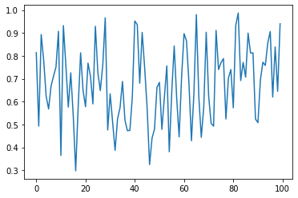
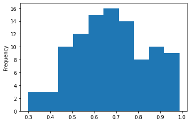
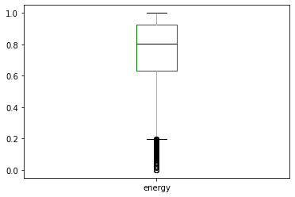
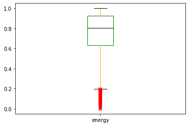
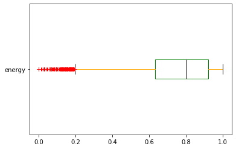
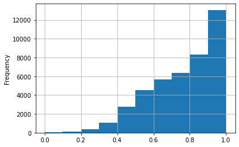
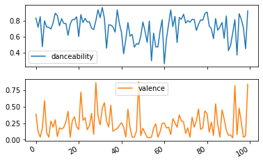

# Hello World!
Insert explorer image here

Last week, we covered how to scrape and load data into a pandas dataframe. We also started cleaning our dataframe for example by splitting or removing columns. 

In this lesson, we will continue exploring the dataset and start looking at the values in the columns. We will take a look at their distribution, mean and variance. This also allows us to check for any outliers.

For the examples, we go back to the Spotify dataset we saw in the introduction lecture.

# Revision Lesson 1 
Since this is a new dataset, we will revisit the functions we learnt in the first class to get a grasp of the data.


```python
import pandas as pd
```

The Spotify dataset can be downloaded from kaggle [here](https://www.kaggle.com/mrmorj/dataset-of-songs-in-spotify).


```python
df = pd.read_csv('/content/genres_v2.csv')
```

    /usr/local/lib/python3.6/dist-packages/IPython/core/interactiveshell.py:2718: DtypeWarning: Columns (19) have mixed types.Specify dtype option on import or set low_memory=False.
      interactivity=interactivity, compiler=compiler, result=result)
    


```python
# First, we will show a subset of the sample
df.head()
```


<div>
<style scoped>
    .dataframe tbody tr th:only-of-type {
        vertical-align: middle;
    }

    .dataframe tbody tr th {
        vertical-align: top;
    }

    .dataframe thead th {
        text-align: right;
    }
</style>
<table border="1" class="dataframe">
  <thead>
    <tr style="text-align: right;">
      <th></th>
      <th>danceability</th>
      <th>energy</th>
      <th>key</th>
      <th>loudness</th>
      <th>mode</th>
      <th>speechiness</th>
      <th>acousticness</th>
      <th>instrumentalness</th>
      <th>liveness</th>
      <th>valence</th>
      <th>tempo</th>
      <th>type</th>
      <th>id</th>
      <th>uri</th>
      <th>track_href</th>
      <th>analysis_url</th>
      <th>duration_ms</th>
      <th>time_signature</th>
      <th>genre</th>
      <th>song_name</th>
      <th>Unnamed: 0</th>
      <th>title</th>
    </tr>
  </thead>
  <tbody>
    <tr>
      <th>0</th>
      <td>0.831</td>
      <td>0.814</td>
      <td>2</td>
      <td>-7.364</td>
      <td>1</td>
      <td>0.4200</td>
      <td>0.0598</td>
      <td>0.013400</td>
      <td>0.0556</td>
      <td>0.3890</td>
      <td>156.985</td>
      <td>audio_features</td>
      <td>2Vc6NJ9PW9gD9q343XFRKx</td>
      <td>spotify:track:2Vc6NJ9PW9gD9q343XFRKx</td>
      <td>https://api.spotify.com/v1/tracks/2Vc6NJ9PW9gD...</td>
      <td>https://api.spotify.com/v1/audio-analysis/2Vc6...</td>
      <td>124539</td>
      <td>4</td>
      <td>Dark Trap</td>
      <td>Mercury: Retrograde</td>
      <td>NaN</td>
      <td>NaN</td>
    </tr>
    <tr>
      <th>1</th>
      <td>0.719</td>
      <td>0.493</td>
      <td>8</td>
      <td>-7.230</td>
      <td>1</td>
      <td>0.0794</td>
      <td>0.4010</td>
      <td>0.000000</td>
      <td>0.1180</td>
      <td>0.1240</td>
      <td>115.080</td>
      <td>audio_features</td>
      <td>7pgJBLVz5VmnL7uGHmRj6p</td>
      <td>spotify:track:7pgJBLVz5VmnL7uGHmRj6p</td>
      <td>https://api.spotify.com/v1/tracks/7pgJBLVz5Vmn...</td>
      <td>https://api.spotify.com/v1/audio-analysis/7pgJ...</td>
      <td>224427</td>
      <td>4</td>
      <td>Dark Trap</td>
      <td>Pathology</td>
      <td>NaN</td>
      <td>NaN</td>
    </tr>
    <tr>
      <th>2</th>
      <td>0.850</td>
      <td>0.893</td>
      <td>5</td>
      <td>-4.783</td>
      <td>1</td>
      <td>0.0623</td>
      <td>0.0138</td>
      <td>0.000004</td>
      <td>0.3720</td>
      <td>0.0391</td>
      <td>218.050</td>
      <td>audio_features</td>
      <td>0vSWgAlfpye0WCGeNmuNhy</td>
      <td>spotify:track:0vSWgAlfpye0WCGeNmuNhy</td>
      <td>https://api.spotify.com/v1/tracks/0vSWgAlfpye0...</td>
      <td>https://api.spotify.com/v1/audio-analysis/0vSW...</td>
      <td>98821</td>
      <td>4</td>
      <td>Dark Trap</td>
      <td>Symbiote</td>
      <td>NaN</td>
      <td>NaN</td>
    </tr>
    <tr>
      <th>3</th>
      <td>0.476</td>
      <td>0.781</td>
      <td>0</td>
      <td>-4.710</td>
      <td>1</td>
      <td>0.1030</td>
      <td>0.0237</td>
      <td>0.000000</td>
      <td>0.1140</td>
      <td>0.1750</td>
      <td>186.948</td>
      <td>audio_features</td>
      <td>0VSXnJqQkwuH2ei1nOQ1nu</td>
      <td>spotify:track:0VSXnJqQkwuH2ei1nOQ1nu</td>
      <td>https://api.spotify.com/v1/tracks/0VSXnJqQkwuH...</td>
      <td>https://api.spotify.com/v1/audio-analysis/0VSX...</td>
      <td>123661</td>
      <td>3</td>
      <td>Dark Trap</td>
      <td>ProductOfDrugs (Prod. The Virus and Antidote)</td>
      <td>NaN</td>
      <td>NaN</td>
    </tr>
    <tr>
      <th>4</th>
      <td>0.798</td>
      <td>0.624</td>
      <td>2</td>
      <td>-7.668</td>
      <td>1</td>
      <td>0.2930</td>
      <td>0.2170</td>
      <td>0.000000</td>
      <td>0.1660</td>
      <td>0.5910</td>
      <td>147.988</td>
      <td>audio_features</td>
      <td>4jCeguq9rMTlbMmPHuO7S3</td>
      <td>spotify:track:4jCeguq9rMTlbMmPHuO7S3</td>
      <td>https://api.spotify.com/v1/tracks/4jCeguq9rMTl...</td>
      <td>https://api.spotify.com/v1/audio-analysis/4jCe...</td>
      <td>123298</td>
      <td>4</td>
      <td>Dark Trap</td>
      <td>Venom</td>
      <td>NaN</td>
      <td>NaN</td>
    </tr>
  </tbody>
</table>
</div>


```python
# Next, let's take a look at the column names
df.columns
```


    Index(['danceability', 'energy', 'key', 'loudness', 'mode', 'speechiness',
           'acousticness', 'instrumentalness', 'liveness', 'valence', 'tempo',
           'type', 'id', 'uri', 'track_href', 'analysis_url', 'duration_ms',
           'time_signature', 'genre', 'song_name', 'Unnamed: 0', 'title'],
          dtype='object')


```python
# Check for the number of unique values per column
df.nunique()
```


    danceability          921
    energy                955
    key                    12
    loudness            12105
    mode                    2
    speechiness          1474
    acousticness         4707
    instrumentalness     4867
    liveness             1737
    valence              1716
    tempo               15569
    type                    1
    id                  35877
    uri                 35877
    track_href          35877
    analysis_url        35877
    duration_ms         26261
    time_signature          4
    genre                  15
    song_name           15439
    Unnamed: 0          20780
    title                 132
    dtype: int64


```python
# check the number of rows and columns in the dataframe
df.shape
```


    (42305, 22)


```python
# drop the columns that seem redundant or non-informative (own interpretation)
df.drop(['id', 'uri', 'track_href', 'analysis_url', 'Unnamed: 0', 'title', 'song_name'], axis=1, inplace=True)
```


```python
# check for missing values
df.isna().sum()
```


    danceability        0
    energy              0
    key                 0
    loudness            0
    mode                0
    speechiness         0
    acousticness        0
    instrumentalness    0
    liveness            0
    valence             0
    tempo               0
    type                0
    duration_ms         0
    time_signature      0
    genre               0
    dtype: int64


## Univariate Plots
To visualize the data in one of these columns we can use the pandas plotting function plot(). By default, it shows us a line plot in this case for the data in the energy column. 

https://pandas.pydata.org/pandas-docs/stable/user_guide/visualization.html


```python
# Plot the energy values for the first 100 songs
df.energy[:100].plot()
```


    <matplotlib.axes._subplots.AxesSubplot at 0x7ffb9fcfd898>





Besides this default line plot, pandas allows us use many more types of visualizations such as: 

* ‘bar’ or ‘barh’ for bar plots
* ‘hist’ for histogram
* ‘box’ for boxplot
* ‘kde’ or ‘density’ for density plots
* ‘area’ for area plots
* ‘scatter’ for scatter plots
* ‘hexbin’ for hexagonal bin plots
* ‘pie’ for pie plots

https://pandas.pydata.org/pandas-docs/stable/user_guide/visualization.html#other-plots


```python
# Try a histogram
df.energy[:100].plot(kind='hist')
```


    <matplotlib.axes._subplots.AxesSubplot at 0x7ffba00b2a58>





A kernel density estimate (KDE) plot is a method for visualizing the distribution of observations in a dataset, analagous to a histogram. KDE represents the data using a continuous probability density curve in one or more dimensions.


```python
# Try a density plot to see the difference with the histogram
df.energy.plot(kind='density')
```


    <matplotlib.axes._subplots.AxesSubplot at 0x7fa3f14030f0>


## Descriptive Statistics

Descriptive Statistics include those that summarize the central tendency, dispersion and shape of a dataset’s distribution, excluding NaN values.

For numeric data, the result’s index will include count, mean, std, min, max as well as lower, 50 and upper percentiles. By default the lower percentile is 25 and the upper percentile is 75. The 50 percentile is the same as the median.

For object data (e.g. strings or timestamps), the result’s index will include count, unique, top, and freq. The top is the most common value. The freq is the most common value’s frequency. Timestamps also include the first and last items.

More info on: 
 [df.describe()](https://pandas.pydata.org/pandas-docs/stable/reference/api/pandas.DataFrame.describe.html)


```python
# Show the mean of the energy variable
df.energy.mean()
```


    0.7625155912539824


```python
# Show the standard deviation of energy 
df.energy.std()
```


    0.1838231312300911


```python
# apply the describe function to see descriptive stats for all the columns (include='all')
df.describe(include='all')
```


<div>
<style scoped>
    .dataframe tbody tr th:only-of-type {
        vertical-align: middle;
    }

    .dataframe tbody tr th {
        vertical-align: top;
    }

    .dataframe thead th {
        text-align: right;
    }
</style>
<table border="1" class="dataframe">
  <thead>
    <tr style="text-align: right;">
      <th></th>
      <th>danceability</th>
      <th>energy</th>
      <th>key</th>
      <th>loudness</th>
      <th>mode</th>
      <th>speechiness</th>
      <th>acousticness</th>
      <th>instrumentalness</th>
      <th>liveness</th>
      <th>valence</th>
      <th>tempo</th>
      <th>type</th>
      <th>duration_ms</th>
      <th>time_signature</th>
      <th>genre</th>
    </tr>
  </thead>
  <tbody>
    <tr>
      <th>count</th>
      <td>42305.000000</td>
      <td>42305.000000</td>
      <td>42305.000000</td>
      <td>42305.000000</td>
      <td>42305.000000</td>
      <td>42305.000000</td>
      <td>42305.000000</td>
      <td>42305.000000</td>
      <td>42305.000000</td>
      <td>42305.000000</td>
      <td>42305.000000</td>
      <td>42305</td>
      <td>42305.000000</td>
      <td>42305.000000</td>
      <td>42305</td>
    </tr>
    <tr>
      <th>unique</th>
      <td>NaN</td>
      <td>NaN</td>
      <td>NaN</td>
      <td>NaN</td>
      <td>NaN</td>
      <td>NaN</td>
      <td>NaN</td>
      <td>NaN</td>
      <td>NaN</td>
      <td>NaN</td>
      <td>NaN</td>
      <td>1</td>
      <td>NaN</td>
      <td>NaN</td>
      <td>15</td>
    </tr>
    <tr>
      <th>top</th>
      <td>NaN</td>
      <td>NaN</td>
      <td>NaN</td>
      <td>NaN</td>
      <td>NaN</td>
      <td>NaN</td>
      <td>NaN</td>
      <td>NaN</td>
      <td>NaN</td>
      <td>NaN</td>
      <td>NaN</td>
      <td>audio_features</td>
      <td>NaN</td>
      <td>NaN</td>
      <td>Underground Rap</td>
    </tr>
    <tr>
      <th>freq</th>
      <td>NaN</td>
      <td>NaN</td>
      <td>NaN</td>
      <td>NaN</td>
      <td>NaN</td>
      <td>NaN</td>
      <td>NaN</td>
      <td>NaN</td>
      <td>NaN</td>
      <td>NaN</td>
      <td>NaN</td>
      <td>42305</td>
      <td>NaN</td>
      <td>NaN</td>
      <td>5875</td>
    </tr>
    <tr>
      <th>mean</th>
      <td>0.639364</td>
      <td>0.762516</td>
      <td>5.370240</td>
      <td>-6.465442</td>
      <td>0.549462</td>
      <td>0.136561</td>
      <td>0.096160</td>
      <td>0.283048</td>
      <td>0.214079</td>
      <td>0.357101</td>
      <td>147.474056</td>
      <td>NaN</td>
      <td>250865.846685</td>
      <td>3.972580</td>
      <td>NaN</td>
    </tr>
    <tr>
      <th>std</th>
      <td>0.156617</td>
      <td>0.183823</td>
      <td>3.666145</td>
      <td>2.941165</td>
      <td>0.497553</td>
      <td>0.126168</td>
      <td>0.170827</td>
      <td>0.370791</td>
      <td>0.175576</td>
      <td>0.233200</td>
      <td>23.844623</td>
      <td>NaN</td>
      <td>102957.713571</td>
      <td>0.268342</td>
      <td>NaN</td>
    </tr>
    <tr>
      <th>min</th>
      <td>0.065100</td>
      <td>0.000243</td>
      <td>0.000000</td>
      <td>-33.357000</td>
      <td>0.000000</td>
      <td>0.022700</td>
      <td>0.000001</td>
      <td>0.000000</td>
      <td>0.010700</td>
      <td>0.018700</td>
      <td>57.967000</td>
      <td>NaN</td>
      <td>25600.000000</td>
      <td>1.000000</td>
      <td>NaN</td>
    </tr>
    <tr>
      <th>25%</th>
      <td>0.524000</td>
      <td>0.632000</td>
      <td>1.000000</td>
      <td>-8.161000</td>
      <td>0.000000</td>
      <td>0.049100</td>
      <td>0.001730</td>
      <td>0.000000</td>
      <td>0.099600</td>
      <td>0.161000</td>
      <td>129.931000</td>
      <td>NaN</td>
      <td>179840.000000</td>
      <td>4.000000</td>
      <td>NaN</td>
    </tr>
    <tr>
      <th>50%</th>
      <td>0.646000</td>
      <td>0.803000</td>
      <td>6.000000</td>
      <td>-6.234000</td>
      <td>1.000000</td>
      <td>0.075500</td>
      <td>0.016400</td>
      <td>0.005940</td>
      <td>0.135000</td>
      <td>0.322000</td>
      <td>144.973000</td>
      <td>NaN</td>
      <td>224760.000000</td>
      <td>4.000000</td>
      <td>NaN</td>
    </tr>
    <tr>
      <th>75%</th>
      <td>0.766000</td>
      <td>0.923000</td>
      <td>9.000000</td>
      <td>-4.513000</td>
      <td>1.000000</td>
      <td>0.193000</td>
      <td>0.107000</td>
      <td>0.722000</td>
      <td>0.294000</td>
      <td>0.522000</td>
      <td>161.464000</td>
      <td>NaN</td>
      <td>301133.000000</td>
      <td>4.000000</td>
      <td>NaN</td>
    </tr>
    <tr>
      <th>max</th>
      <td>0.988000</td>
      <td>1.000000</td>
      <td>11.000000</td>
      <td>3.148000</td>
      <td>1.000000</td>
      <td>0.946000</td>
      <td>0.988000</td>
      <td>0.989000</td>
      <td>0.988000</td>
      <td>0.988000</td>
      <td>220.290000</td>
      <td>NaN</td>
      <td>913052.000000</td>
      <td>5.000000</td>
      <td>NaN</td>
    </tr>
  </tbody>
</table>
</div>


## Boxplot
A boxplot is another way of visualizing the distribution of data. A boxplot is a standardized way of displaying the distribution of data based on a five number summary (“minimum”, first quartile (Q1), median ("middle" value), third quartile (Q3), and “maximum”). More info can be found in[ this blog ](https://towardsdatascience.com/understanding-boxplots-5e2df7bcbd51)


```python
# Plot a boxplot for the energy column
df.energy.plot(kind= 'box')
```


    <matplotlib.axes._subplots.AxesSubplot at 0x7fa3d8ab8dd8>


```python
# specify the colors
color = {
     "boxes": "Green",
     "whiskers": "Orange",
     "medians": "Black",
     "caps": "Black",
 }
 
# use the predefined colors
df.energy.plot(kind='box', color=color)
```


    <matplotlib.axes._subplots.AxesSubplot at 0x7ffba079c1d0>





```python
# set the symbol (sym)
df.energy.plot(kind='box', color=color, sym= 'rx')
```


    <matplotlib.axes._subplots.AxesSubplot at 0x7fa3d774a7b8>





```python
# switch to a horizontal plot
df.energy.plot(kind= 'box', color=color, sym="r+", vert=False);
```


## Outlier Detection

Boxplot shows dots for outliers. We will check for outliers now using the Standard Deviation method. This method is applicable to values with a Gaussian-like distribution. You can read more about this and other  methods for outlier detection here: 
https://machinelearningmastery.com/how-to-use-statistics-to-identify-outliers-in-data/


```python
# Before removing any outliers we have 23615 observations in the sample
df.shape
```


    (42305, 15)


```python
data_mean = df.energy.mean()
data_std = df.energy.std()

# define upper and lower bounds based on Gaussian assumption
cut_off = data_std * 3
lower = data_mean - cut_off
upper = data_mean + cut_off
```


```python
# Show the dataframe without outliers
df[((df["energy"] > lower) & (df["energy"] < upper))].sample(5)
```


<div>
<style scoped>
    .dataframe tbody tr th:only-of-type {
        vertical-align: middle;
    }

    .dataframe tbody tr th {
        vertical-align: top;
    }

    .dataframe thead th {
        text-align: right;
    }
</style>
<table border="1" class="dataframe">
  <thead>
    <tr style="text-align: right;">
      <th></th>
      <th>danceability</th>
      <th>energy</th>
      <th>key</th>
      <th>loudness</th>
      <th>mode</th>
      <th>speechiness</th>
      <th>acousticness</th>
      <th>instrumentalness</th>
      <th>liveness</th>
      <th>valence</th>
      <th>tempo</th>
      <th>type</th>
      <th>duration_ms</th>
      <th>time_signature</th>
      <th>genre</th>
    </tr>
  </thead>
  <tbody>
    <tr>
      <th>42127</th>
      <td>0.647</td>
      <td>0.957</td>
      <td>9</td>
      <td>-4.233</td>
      <td>1</td>
      <td>0.0549</td>
      <td>0.029000</td>
      <td>0.606000</td>
      <td>0.021</td>
      <td>0.591</td>
      <td>150.008</td>
      <td>audio_features</td>
      <td>387208</td>
      <td>4</td>
      <td>hardstyle</td>
    </tr>
    <tr>
      <th>2322</th>
      <td>0.841</td>
      <td>0.686</td>
      <td>10</td>
      <td>-7.207</td>
      <td>0</td>
      <td>0.3940</td>
      <td>0.001290</td>
      <td>0.000000</td>
      <td>0.428</td>
      <td>0.683</td>
      <td>123.952</td>
      <td>audio_features</td>
      <td>190000</td>
      <td>4</td>
      <td>Dark Trap</td>
    </tr>
    <tr>
      <th>36191</th>
      <td>0.422</td>
      <td>0.875</td>
      <td>11</td>
      <td>-3.300</td>
      <td>0</td>
      <td>0.2960</td>
      <td>0.008400</td>
      <td>0.000001</td>
      <td>0.396</td>
      <td>0.594</td>
      <td>143.522</td>
      <td>audio_features</td>
      <td>142500</td>
      <td>4</td>
      <td>trap</td>
    </tr>
    <tr>
      <th>10830</th>
      <td>0.476</td>
      <td>0.495</td>
      <td>7</td>
      <td>-6.095</td>
      <td>1</td>
      <td>0.0242</td>
      <td>0.000033</td>
      <td>0.915000</td>
      <td>0.506</td>
      <td>0.114</td>
      <td>180.000</td>
      <td>audio_features</td>
      <td>137231</td>
      <td>4</td>
      <td>Trap Metal</td>
    </tr>
    <tr>
      <th>6856</th>
      <td>0.629</td>
      <td>0.848</td>
      <td>1</td>
      <td>-2.728</td>
      <td>1</td>
      <td>0.3100</td>
      <td>0.082900</td>
      <td>0.000000</td>
      <td>0.379</td>
      <td>0.278</td>
      <td>170.121</td>
      <td>audio_features</td>
      <td>220147</td>
      <td>4</td>
      <td>Underground Rap</td>
    </tr>
  </tbody>
</table>
</div>


```python
# Show a sample of the outliers
df[(df['energy']<lower) | (df["energy"] > upper)].sample(5)
```


<div>
<style scoped>
    .dataframe tbody tr th:only-of-type {
        vertical-align: middle;
    }

    .dataframe tbody tr th {
        vertical-align: top;
    }

    .dataframe thead th {
        text-align: right;
    }
</style>
<table border="1" class="dataframe">
  <thead>
    <tr style="text-align: right;">
      <th></th>
      <th>danceability</th>
      <th>energy</th>
      <th>key</th>
      <th>loudness</th>
      <th>mode</th>
      <th>speechiness</th>
      <th>acousticness</th>
      <th>instrumentalness</th>
      <th>liveness</th>
      <th>valence</th>
      <th>tempo</th>
      <th>type</th>
      <th>duration_ms</th>
      <th>time_signature</th>
      <th>genre</th>
    </tr>
  </thead>
  <tbody>
    <tr>
      <th>6812</th>
      <td>0.846</td>
      <td>0.158</td>
      <td>8</td>
      <td>-18.191</td>
      <td>1</td>
      <td>0.4190</td>
      <td>0.04200</td>
      <td>0.000041</td>
      <td>0.0845</td>
      <td>0.290</td>
      <td>139.980</td>
      <td>audio_features</td>
      <td>164773</td>
      <td>4</td>
      <td>Underground Rap</td>
    </tr>
    <tr>
      <th>11203</th>
      <td>0.821</td>
      <td>0.211</td>
      <td>8</td>
      <td>-16.042</td>
      <td>1</td>
      <td>0.2120</td>
      <td>0.00172</td>
      <td>0.008160</td>
      <td>0.1070</td>
      <td>0.239</td>
      <td>129.971</td>
      <td>audio_features</td>
      <td>160615</td>
      <td>4</td>
      <td>Trap Metal</td>
    </tr>
    <tr>
      <th>13461</th>
      <td>0.708</td>
      <td>0.186</td>
      <td>9</td>
      <td>-8.953</td>
      <td>0</td>
      <td>0.0422</td>
      <td>0.86800</td>
      <td>0.000000</td>
      <td>0.0779</td>
      <td>0.321</td>
      <td>145.082</td>
      <td>audio_features</td>
      <td>156107</td>
      <td>4</td>
      <td>Emo</td>
    </tr>
    <tr>
      <th>1535</th>
      <td>0.577</td>
      <td>0.181</td>
      <td>6</td>
      <td>-12.530</td>
      <td>0</td>
      <td>0.0424</td>
      <td>0.60400</td>
      <td>0.471000</td>
      <td>0.1110</td>
      <td>0.209</td>
      <td>164.944</td>
      <td>audio_features</td>
      <td>137352</td>
      <td>4</td>
      <td>Dark Trap</td>
    </tr>
    <tr>
      <th>15015</th>
      <td>0.800</td>
      <td>0.205</td>
      <td>4</td>
      <td>-14.792</td>
      <td>0</td>
      <td>0.6370</td>
      <td>0.56900</td>
      <td>0.000000</td>
      <td>0.1050</td>
      <td>0.580</td>
      <td>155.007</td>
      <td>audio_features</td>
      <td>145844</td>
      <td>4</td>
      <td>Rap</td>
    </tr>
  </tbody>
</table>
</div>


Note that the values for energy in the outliers are low (lower than the limit of 0.211) and therefore in the left tail of the distribution of our data.


```python
lower
```


    0.21104619756370901


```python
# Original boxplot (incl. outliers)
df.energy.plot(kind='box', vert=False, color=color, sym="r+") 
```


    <matplotlib.axes._subplots.AxesSubplot at 0x7ffba0349860>





To visualize the removal of outliers, we plot the boxplot again using tha pandas library.


```python
# Let's plot the boxplot again to check for any remaining outliers (if so, boxplot defines outliers differently)

df_without_outliers = df[((df["energy"] > lower) & (df["energy"] < upper))]
df_without_outliers.energy.plot(kind='box', vert=False, color=color, sym='rx') # red crosses
```


    <matplotlib.axes._subplots.AxesSubplot at 0x7ffba02b3588>


We detected 174 outliers in the left tail of the distribution (note that the assumption of a Gaussian distribution is violated here though)


```python
# Check how many are upper vs lower outliers
df[(df['energy']<lower)].shape[0]
```


    174


```python
# All outliers are below the lower limit so we have 0 'upper' outliers.
df[(df['energy']>upper)].shape[0]
```


    0


## Styling of plots
We already changed the colors and the [symbols](https://matplotlib.org/3.1.0/api/markers_api.html) used in the boxplot. These changes make the plot easier to understand because the red crosses easily grab your attention. Also, the colors in the box and whiskers make it easier to distinguish the difference between the box and the whiskers.

There are some more formatting options we can change to set the styling of our plots. 


*   legend
* title
* subplots : seperate plots per column
*   xlim
*  ylim
* logx : use log scaling for x axis (to show exponential growth)
* grid


https://pandas.pydata.org/pandas-docs/stable/reference/api/pandas.DataFrame.plot.html#pandas.DataFrame.plot


```python
# We can add a title to the plot
df.energy.plot(kind='box', vert=False, color=color, sym="r+", title= 'Boxplot for Energy')
```


    <matplotlib.axes._subplots.AxesSubplot at 0x7fa3d75a6da0>


```python
# We can specify the range on the axis by setting the xlim parameter
df.energy.plot(kind='density', xlim=[0, 1])
```


    <matplotlib.axes._subplots.AxesSubplot at 0x7fa3d7582208>


```python
# Add a grid to a histogram to make the plot easier to read
df.energy.plot(kind='hist', grid=True)
```


    <matplotlib.axes._subplots.AxesSubplot at 0x7fa3d7456be0>





```python
# We can add a legend to plots of more than one variable (multivariate plotting)
df[['energy', 'danceability', 'valence']][:50].plot(legend=True, ylabel='Value', xlabel='Song')
```


    <matplotlib.axes._subplots.AxesSubplot at 0x7f157788f8d0>


# Exercises

To put all this into practice, try the following exercises:


*   Plot other features like danceability, valence etc using the hist/scatter or other plot types
*   Read through the descriptive statistics table and look for interesting/weird statistics
* check for outliers in any of the other variables
* Remove outliers by using the standard deviation method (or another method)
* Save your cleaned dataframe in a .csv file


# Answers

Plot other features like danceability, valence etc using the hist/scatter or other plot types


```python
df[['danceability', 'valence']][:100].plot(subplots=True);
```





For the exercises, the code will be the same so feel free to copy to code or change 'energy' to any of the other variables and interpret what changes.

# EDA Example


```python
# Bestsellers books on Amazon
df_books = pd.read_csv('bestsellers with categories.csv')
```

General information about the df


```python
# A glimpse of the data
df_books.head()
```


<div>
<style scoped>
    .dataframe tbody tr th:only-of-type {
        vertical-align: middle;
    }

    .dataframe tbody tr th {
        vertical-align: top;
    }

    .dataframe thead th {
        text-align: right;
    }
</style>
<table border="1" class="dataframe">
  <thead>
    <tr style="text-align: right;">
      <th></th>
      <th>Name</th>
      <th>Author</th>
      <th>User Rating</th>
      <th>Reviews</th>
      <th>Price</th>
      <th>Year</th>
      <th>Genre</th>
    </tr>
  </thead>
  <tbody>
    <tr>
      <th>0</th>
      <td>10-Day Green Smoothie Cleanse</td>
      <td>JJ Smith</td>
      <td>4.7</td>
      <td>17350</td>
      <td>8</td>
      <td>2016</td>
      <td>Non Fiction</td>
    </tr>
    <tr>
      <th>1</th>
      <td>11/22/63: A Novel</td>
      <td>Stephen King</td>
      <td>4.6</td>
      <td>2052</td>
      <td>22</td>
      <td>2011</td>
      <td>Fiction</td>
    </tr>
    <tr>
      <th>2</th>
      <td>12 Rules for Life: An Antidote to Chaos</td>
      <td>Jordan B. Peterson</td>
      <td>4.7</td>
      <td>18979</td>
      <td>15</td>
      <td>2018</td>
      <td>Non Fiction</td>
    </tr>
    <tr>
      <th>3</th>
      <td>1984 (Signet Classics)</td>
      <td>George Orwell</td>
      <td>4.7</td>
      <td>21424</td>
      <td>6</td>
      <td>2017</td>
      <td>Fiction</td>
    </tr>
    <tr>
      <th>4</th>
      <td>5,000 Awesome Facts (About Everything!) (Natio...</td>
      <td>National Geographic Kids</td>
      <td>4.8</td>
      <td>7665</td>
      <td>12</td>
      <td>2019</td>
      <td>Non Fiction</td>
    </tr>
  </tbody>
</table>
</div>


```python
# Information. Null counts, datatypes...
df_books.info()
```

    <class 'pandas.core.frame.DataFrame'>
    RangeIndex: 550 entries, 0 to 549
    Data columns (total 8 columns):
     #   Column       Non-Null Count  Dtype  
    ---  ------       --------------  -----  
     0   Name         550 non-null    object 
     1   Author       550 non-null    object 
     2   User Rating  550 non-null    float64
     3   Reviews      550 non-null    int64  
     4   Price        550 non-null    int64  
     5   Year         550 non-null    int64  
     6   Genre        550 non-null    object 
     7   price_bin    550 non-null    object 
    dtypes: float64(1), int64(3), object(4)
    memory usage: 34.5+ KB
    


```python
# Basic descriptive statistics. Nice overview for numerical data
df_books.describe()

```


<div>
<style scoped>
    .dataframe tbody tr th:only-of-type {
        vertical-align: middle;
    }

    .dataframe tbody tr th {
        vertical-align: top;
    }

    .dataframe thead th {
        text-align: right;
    }
</style>
<table border="1" class="dataframe">
  <thead>
    <tr style="text-align: right;">
      <th></th>
      <th>User Rating</th>
      <th>Reviews</th>
      <th>Price</th>
      <th>Year</th>
    </tr>
  </thead>
  <tbody>
    <tr>
      <th>count</th>
      <td>550.000000</td>
      <td>550.000000</td>
      <td>550.000000</td>
      <td>550.000000</td>
    </tr>
    <tr>
      <th>mean</th>
      <td>4.618364</td>
      <td>11953.281818</td>
      <td>13.203636</td>
      <td>2014.000000</td>
    </tr>
    <tr>
      <th>std</th>
      <td>0.226980</td>
      <td>11731.132017</td>
      <td>10.777362</td>
      <td>3.165156</td>
    </tr>
    <tr>
      <th>min</th>
      <td>3.300000</td>
      <td>37.000000</td>
      <td>0.000000</td>
      <td>2009.000000</td>
    </tr>
    <tr>
      <th>25%</th>
      <td>4.500000</td>
      <td>4058.000000</td>
      <td>7.000000</td>
      <td>2011.000000</td>
    </tr>
    <tr>
      <th>50%</th>
      <td>4.700000</td>
      <td>8580.000000</td>
      <td>11.000000</td>
      <td>2014.000000</td>
    </tr>
    <tr>
      <th>75%</th>
      <td>4.800000</td>
      <td>17253.250000</td>
      <td>16.000000</td>
      <td>2017.000000</td>
    </tr>
    <tr>
      <th>max</th>
      <td>4.900000</td>
      <td>87841.000000</td>
      <td>105.000000</td>
      <td>2019.000000</td>
    </tr>
  </tbody>
</table>
</div>


Group by function


```python
#group_by 'Author', and see the count/mean/etc
authors = df_books.groupby('Author').count()
```


```python
#Get the 5 top performing authors by number of books. Useful to sort values
authors['Name'].sort_values(ascending=False)[:5]
```


    Author
    Jeff Kinney                           12
    Rick Riordan                          11
    Gary Chapman                          11
    Suzanne Collins                       11
    American Psychological Association    10
    Name: Name, dtype: int64


```python
# Plot the evolution of User Rating over years
df_books.groupby('Year').mean()['User Rating'].plot()
```


```python
# Is in function along with index list
df_books[df_books['Author'].isin(idxs)]['Name']
```

Slicing and Indexing


```python
# Access something with multiple conditions (standard way)
df_books[(df_books['Author'] == 'Jeff Kinney') & (df_books['Price'] == 0)]['Price']
```


    42     0
    71     0
    381    0
    Name: Price, dtype: int64


```python
# How would I assign? With .loc 
df_books.loc[(df_books['Author'] == 'Jeff Kinney') & (df_books['Price'] != 0), ['Price']] = 14

```


```python
# slicing by the index with iloc
df_books.iloc[1:6, :5]
```


<div>
<style scoped>
    .dataframe tbody tr th:only-of-type {
        vertical-align: middle;
    }

    .dataframe tbody tr th {
        vertical-align: top;
    }

    .dataframe thead th {
        text-align: right;
    }
</style>
<table border="1" class="dataframe">
  <thead>
    <tr style="text-align: right;">
      <th></th>
      <th>title</th>
      <th>author</th>
      <th>user rating</th>
      <th>reviews</th>
      <th>price</th>
    </tr>
  </thead>
  <tbody>
    <tr>
      <th>1</th>
      <td>11/22/63: A Novel</td>
      <td>Stephen King</td>
      <td>4.6</td>
      <td>2052</td>
      <td>22</td>
    </tr>
    <tr>
      <th>2</th>
      <td>12 Rules for Life: An Antidote to Chaos</td>
      <td>Jordan B. Peterson</td>
      <td>4.7</td>
      <td>18979</td>
      <td>15</td>
    </tr>
    <tr>
      <th>3</th>
      <td>1984 (Signet Classics)</td>
      <td>George Orwell</td>
      <td>4.7</td>
      <td>21424</td>
      <td>6</td>
    </tr>
    <tr>
      <th>4</th>
      <td>5,000 Awesome Facts (About Everything!) (Natio...</td>
      <td>National Geographic Kids</td>
      <td>4.8</td>
      <td>7665</td>
      <td>12</td>
    </tr>
    <tr>
      <th>5</th>
      <td>A Dance with Dragons (A Song of Ice and Fire)</td>
      <td>George R. R. Martin</td>
      <td>4.4</td>
      <td>12643</td>
      <td>11</td>
    </tr>
  </tbody>
</table>
</div>


Apply a function


```python
# Define a function
def price_bin(price):
  if price < 10:
    return 'cheap'
  elif price >= 10 and price < 20:
    return 'medium'
  elif price >= 20:
    return 'expensive'
```


```python
# ... and apply it!
df_books['price_bin'] = df_books['Price'].apply(price_bin)
```


```python
# barplot of value counts
df_books['price_bin'].value_counts().plot(kind='bar')
```

# Concluding Remarks
In today's lesson, we have looked at the univariate distributions of our columns. This brings us one step furter towards finding interesting data stories! Next week, we will take a look at correlations between variables and multivariate plots.

We save the cleaned version of our dataset such that we don't have to do the cleaning again! :)


```python
# Save the dataframe by applying the function to_csv('filename.csv')

df.to_csv('cleaned_spotify.csv')

# The csv file can be downloaded to your local computer from the files menu on the left
```


```python

```
